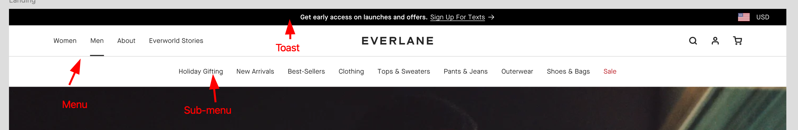

#Header
I need to build this header:


## Functionality

The header need to consist of:

### Toast

toggable toast at the top of the screen for notifications.

### Main menu

The main menu, which should be a configuable list in my cms system. The menu points should have the following options:

1. Link to an internal page
2. Link to an external page
3. The option to set a "target"
4. Set the link text
5. Create a link that opens the sub-menu

#### Sub menu

When a main menu entry point has child pages, the main menu should not have a link to any where. It should then be rendered as a button that opens the menu.

### Data

I imagine that the data i get back from my cms to build the menu looks something like this:

```jsonc
{
  "menu": [
    {
      "url": "/some-internal-page",
      "target": "_self",
      "type": "internal",
      "text": "some-link-text",
    },
    {
      "url": "https://google.com",
      "target": "_blank",
      "type": "external",
      "text": "some-link-text",
    },
    {
      "text": "some-link-text",
      "children": [
        {
          "url": "/some-internal-page",
          "target": "_self",
          "type": "internal",
          "text": "some-link-text",
        },
        {
          "url": "https://google.com",
          "target": "_blank",
          "type": "external",
          "text": "some-link-text",
        },
      ],
    },
  ],
}
```

# Implementation help
I need help with building the payloadcms side of things and possible a bootstrap setup of the menu.
